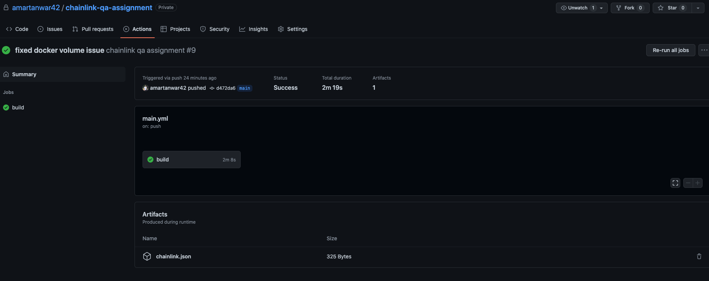
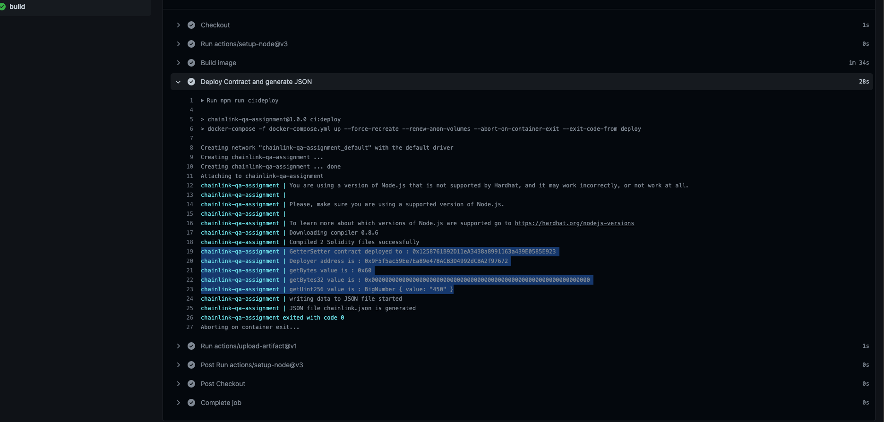

<!-- @format -->

# Chainlink QA Assignment

### This project uses the Hardhat to deploy the contract and it does following:

- Deploying `GetterSetter` contract to `Kovan` network.
- Performing all `getter` and `setter` operations
- Printing deployed address and the value set in the console.
- Storing following information in JSON file.
  - GetterSetter contract deployed address
  - Deployer address
  - Value set

## Project features :

- Dockerized using `Dockerfile` and `docker-compose.yml`.
- Linked with `Github Actions`
  - Perform deployment upon each commit.
  - Performing all getter setter operations and printing result in console.
  - Writing and publishing JSON file in the artifacts

## Sample CICD Build link:

https://github.com/amartanwar42/chainlink-qa-assignment/actions/runs/2379564791

### Steps to deploy contract and perform all operations manually:

```shell
npx hardhat run  scripts/deploy-script.js
```

### Note: Generated JSON `chainlink.json` can be found in the `result` folder in the root of the project

## References screenshots:

Artifacts > JSON file


Console print

